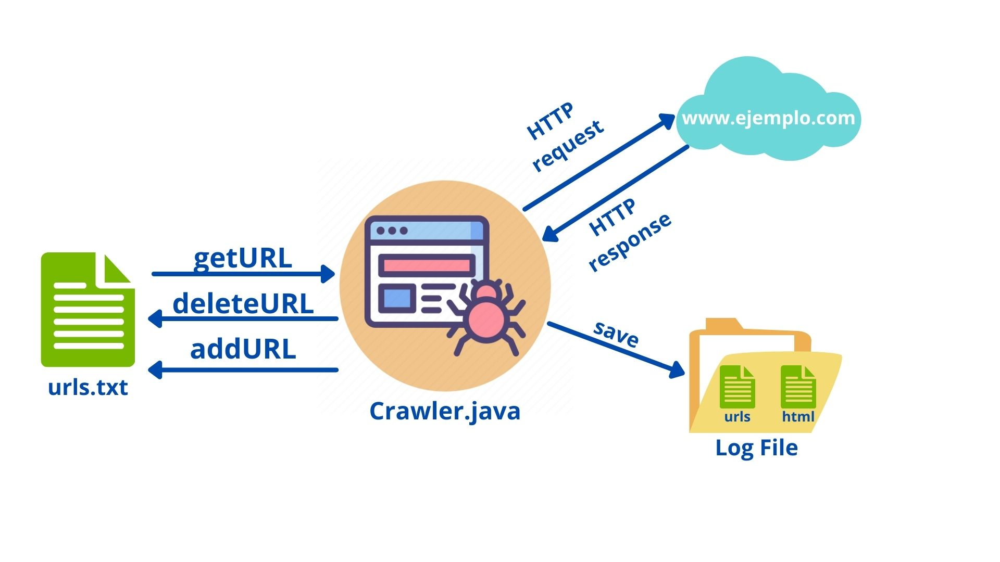

# Crawler Project

_Description of the project_


## Quick Start 🚀

_Instructions on how to get a copy of the proyect to work on your local machine for further development_

Something in **bold**.


### Requirements 📋

_What tools do you need to install the software and how to use them_

```
Example here
```

### Installation 🔧

_A series of step by step examples saying what to execute in order to have a development environment running_

_Some step here_

```
Example step
```

_Another step here_

```
Example step
```

_Finalize with an example on how to obtain data from the system or how to use it for a demo_

## Tools used 🛠️

_Mention the tools used in order to develop the project_

* [Github](http://www.github.com/) - Github for version control
* [VS Code](https://code.visualstudio.com/) - IDE Used

## Title 2 ⚙️

More text here

### Title 3 🔩

Some more text here

```
Example
```


---
Build with ❤️ by David Luengo 😊